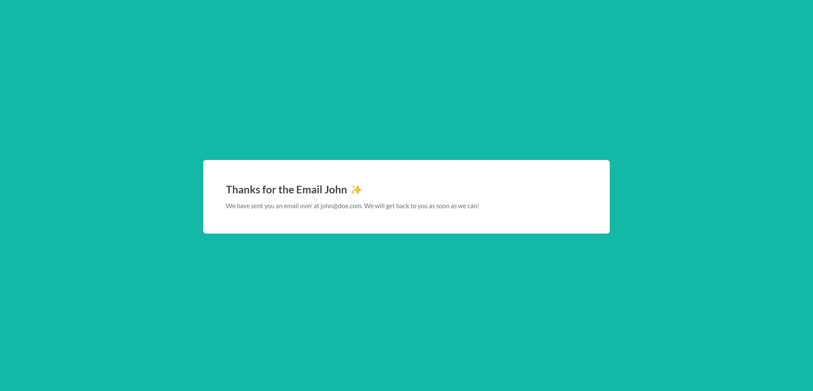

# Creating forms using React.js and Next.js

This is a [Next.js](https://nextjs.org/) project bootstrapped with [`create-next-app`](https://github.com/vercel/next.js/tree/canary/packages/create-next-app).

## Table of contents

- [Creating forms using React.js and Next.js](#creating-forms-using-reactjs-and-nextjs)
  - [Table of contents](#table-of-contents)
  - [Getting Started](#getting-started)
  - [Overview](#overview)
    - [Screenshot](#screenshot)
    - [Links](#links)
  - [My process](#my-process)
    - [Built with](#built-with)

## Getting Started

First, run the development server:

```bash
npm run dev
# or
yarn dev
```

## Overview

### Screenshot




### Links

- [Live Demo](https://react-form-with-next.vercel.app/)

## My process

### Built with

- Next.js pages
- Tailwind CSS
- Framer-motion animation library for React
